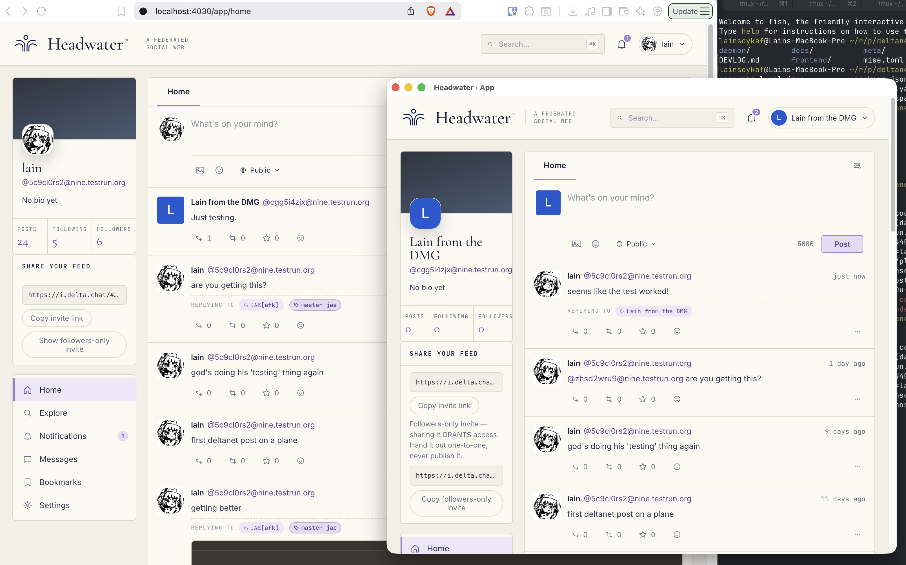

# Headwater

Your own single-user social network, federated over encrypted email.

Headwater feels like a small personal Pleroma or Mastodon instance, but there is
no multi-user server and no ActivityPub. Your identity is a chatmail address,
your feed is an end-to-end-encrypted Delta Chat broadcast, and following someone
means joining their feed with an invite link.

## Download a nightly

**[Download the latest Headwater desktop nightly](https://github.com/lambadalambda/headwater/releases/tag/nightly)**

Nightlies are built from the latest tested `main` branch for:

| Platform | Download |
| --- | --- |
| Linux x64 | Flatpak (recommended) or AppImage |
| Windows x64 | NSIS installer (`.exe`) |
| macOS Apple silicon | DMG (`.dmg`) |

These are unsigned alpha development builds. They are not notarized or signed
by a trusted developer certificate, may trigger operating-system warnings, and
must be updated manually. Broader abrupt-process recovery and packaged
create/restore acceptance work is still incomplete, so treat identities created
with nightlies as disposable. Compare downloads with `SHA256SUMS.txt` on the
release page to detect corruption; because the checksums are published beside
unsigned artifacts, they do not prove publisher identity.

The application stores identity and account data separately from the downloaded
installer or executable. A nightly is **not a backup**. Use **Settings → Backup**
to create an encrypted Headwater backup before replacing or removing data.
Flatpak and AppImage use separate data locations and do not automatically share
or migrate identities.

## What Headwater looks like



Each Headwater node belongs to one person. It runs the web interface and a local
daemon that translates familiar social actions into encrypted Delta Chat
messages:

```text
Headwater app → local daemon → Delta Chat core → chatmail relay
```

Relays temporarily store encrypted mail and cannot read post bodies or recover
your identity keys. They can still observe delivery metadata such as addresses,
timing, and message sizes. Store-and-forward delivery lets your node go offline
and catch up later within the relay's finite retention window.

## Try it

1. Install a
   [desktop nightly](https://github.com/lambadalambda/headwater/releases/tag/nightly),
   or run Headwater with a container.
2. Create an account and choose a display name. Headwater registers a chatmail
   address for you.
3. Save the required recovery backup and keep its passphrase separately.
   Headwater cannot recover either one for you.
4. Paste this example invite into the app's search box and choose
   **Follow this feed**:

**[Follow lain's Headwater feed](https://i.delta.chat/#4C32E895E490B1D686A1E83A7B57BBE71A581118&v=3&x=G55gNRWoui_KFVUaXWZKCXL2&j=fB5efM7GCJntgRY0W6mgnqvS&s=WLtaS8FadzpCB8Im0KzjLpLS&a=5c9cl0rs2%40nine.testrun.org&n=lain&b=lain%27s+feed)**

```text
https://i.delta.chat/#4C32E895E490B1D686A1E83A7B57BBE71A581118&v=3&x=G55gNRWoui_KFVUaXWZKCXL2&j=fB5efM7GCJntgRY0W6mgnqvS&s=WLtaS8FadzpCB8Im0KzjLpLS&a=5c9cl0rs2%40nine.testrun.org&n=lain&b=lain%27s+feed
```

Share the public invite from your own **Share your feed** card so other people
can follow you. Followers-only invites grant access and should be handed out
privately, never published. This example uses a public test relay and may become
unavailable if its demo account is inactive for the relay's retention period.

## Run with Docker or Podman

The desktop app is the easiest way to try Headwater. For a persistent local web
node, the production container listens only on `127.0.0.1:4030` by default:

```sh
git clone https://github.com/lambadalambda/headwater.git
cd headwater
docker compose up -d
# or
podman compose up -d
```

Open <http://localhost:4030> and follow the enrollment instructions printed by
`docker compose logs -f` or `podman compose logs -f`. Keep the generated
`headwater-data` volume: deleting it deletes the local identity. See the
[development and operations guide](docs/development.md#docker-and-podman) for
updates, direct Podman usage, reverse proxies, and data paths.

## Current scope

Headwater supports public, followers-only, and direct posts; invite-based
following; replies and thread backfill; verified boosts; favourites and emoji
reactions; notifications and live updates; image attachments and alt text;
profiles, petnames, search over known content; and encrypted backup/restore.

It deliberately has no network-wide directory or anonymously fetchable global
post namespace. Some familiar fediverse features remain unavailable in the
bundled daemon, including human chat threads, persisted bookmarks, federated
deletion, mute/block, polls, content warnings, and audio/video uploads. The UI
hides or labels unsupported controls rather than pretending they work.

## Documentation

- [Development and operations](docs/development.md): source setup, containers,
  local security, two-node testing, backups, CI, repository layout, and migration.
- [Architecture and protocol docs](docs/README.md)
- [Frontend/daemon capability contract](meta/frontend-daemon-capabilities.md)
- [Implementation history](DEVLOG.md)

## License

Headwater is released into the public domain under the [Unlicense](LICENSE).
